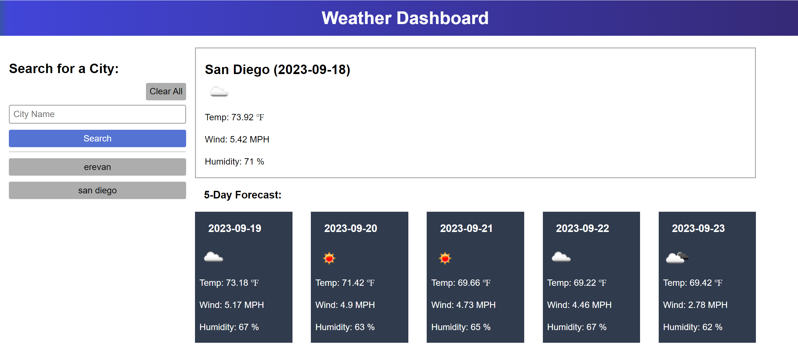

# Weather Dashboard

## Description

This project taught me how fetch data from 3rd party API and display on browsers page.

## Usage

When a user searchs some city, weather dashboard will display current and future forecasts for that city and that city name will be added to the search history. When user clicks on a city in the search history, current and future conditions for that city will be desplayed.

Go to [Weather Dashboard](https://armanbarseghyan83.github.io/weather-dashboard/)

## Credits

Throughout this past year, I have completed different online courses and have previous programming experience by building my portfolio projects.

Please see my [Portfolio](https://armanbarseghyan83.github.io/portfolio/).